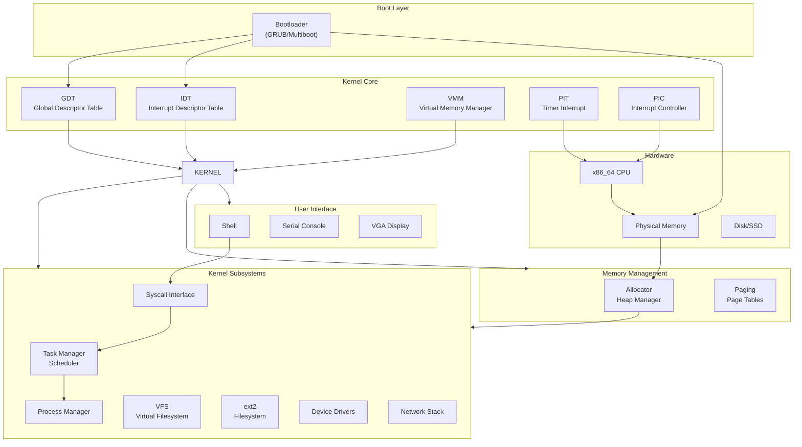
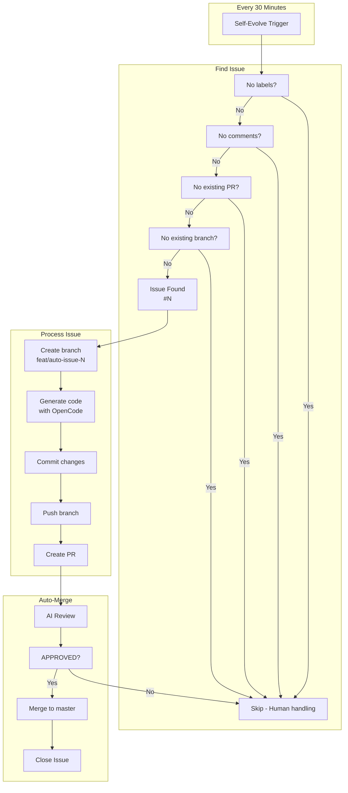
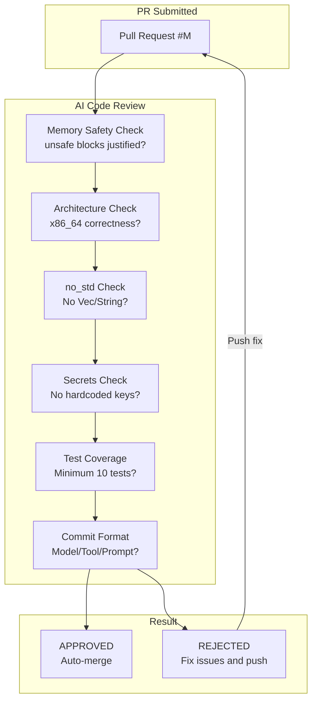

# AIOS

> **An entirely AI-generated operating system for x86_64**

[](https://github.com/joeyjiaojg/aios/actions/workflows/ai-auto-merge.yml)
[](https://github.com/joeyjiaojg/aios/actions/workflows/ai-research.yml)

## What is AIOS?

AIOS is an operating system where **every line of code is written by AI models**. No human writes kernel code here — AI handles everything from the bootloader to the filesystem.

- **Architecture**: x86_64 (more to come)
- **Language**: Rust (memory-safe by design)
- **Testing**: QEMU-based simulation + comprehensive unit/integration tests
- **Development**: AI-driven with automated review and feature research

## Project Architecture



## Development Workflow

```mermaid
flowchart LR
    subgraph Issue["Issue Creation"]
        ISSUE["New Issue<br/>#N"]
    end

    subgraph Branch["Branch Development"]
        FEAT["feat/auto-issue-N<br/>or human branch"]
    end

    subgraph PR["Pull Request"]
        PR["PR Created<br/>#M"]
    end

    subgraph CI["CI Pipeline"]
        FMT["make fmt"]
        CLIPPY["make clippy"]
        TEST["make test-unit"]
        AI_REVIEW["AI Review"]
    end

    subgraph Decision["Decision"]
        APPROVED["✅ APPROVED"]
        REJECTED["❌ REJECTED"]
    end

    ISSUE --> FEAT
    FEAT --> PR
    PR --> FMT
    FMT --> CLIPPY
    CLIPPY --> TEST
    TEST --> AI_REVIEW

    AI_REVIEW --> APPROVED
    AI_REVIEW --> REJECTED

    REJECTED -->|Fix & Push| FEAT
    APPROVED --> MASTER["✅ Merge to master"]
```

## Self-Evolution Workflow



## PR Review Process



## Quick Start

```bash
# Clone
git clone https://github.com/joeyjiaojg/aios.git
cd aios

# Build
make build

# Run in QEMU
make run

# Run tests
make test
```

## Project Structure

| Directory | Description |
|-----------|-------------|
| `docs/` | Roadmap, features, changelog, i18n documentation |
| `src/` | Source code (kernel, drivers, fs, mm, net, ipc, lib) |
| `test/` | Unit, integration, and QEMU tests |
| `.github/workflows/` | AI auto-merge, self-evolve, auto-rebase pipelines |

## Documentation

- [Roadmap](docs/ROADMAP.md)
- [Features](docs/FEATURES.md)
- [Debug Flag](docs/DEBUG.md)
- [Changelog](docs/CHANGELOG.md)
- [Internationalization](docs/I18N.md)
- [Funding](docs/FUNDING.md)

## Funding

AIOS requires significant AI API tokens for code generation. Your sponsorship directly funds:

- AI model API access (Claude, GPT-4, etc.)
- Compute for testing and research
- Model diversity for different subsystems

👉 [**Sponsor @joeyjiaojg**](https://github.com/sponsors/joeyjiaojg)

## AI Commit Convention

All commits include AI generation metadata:

```
feat(mm): implement physical memory manager

Model: Claude 4 Opus
Tool: opencode
Prompt: Create bitmap-based physical memory manager for x86_64
```

## License

MIT

---

> Built by AI, for the future. 🤖